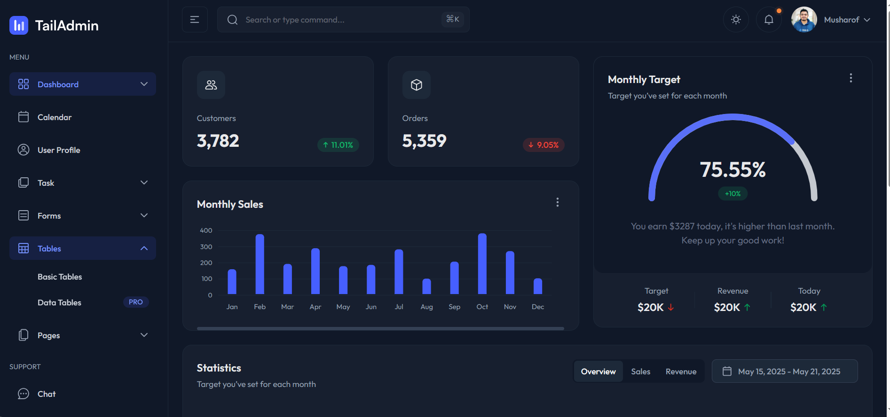

<p align="center">
  <a href="https://laravel.com" target="_blank">
    
  </a>
</p>

---

# Laravel Admin Dashboard with Tailwind CSS v4

A clean and minimal **Admin Dashboard** template built with **Laravel** and styled using **Tailwind CSS v4**. This starter template is perfect for quickly scaffolding internal tools, CMS panels, or B2B applications.

---

## 🚀 Features

-   ✅ **Laravel 10+**: Built on the latest Laravel framework.
-   🎨 **Tailwind CSS v4**: Fully integrated for modern and responsive UI design.
-   🧱 **Component-based UI**: Modular and reusable components for scalability.
-   🔐 **Authentication**: Supports Laravel Breeze or Jetstream (optional).
-   🧭 **Responsive Layout**: Optimized for all screen sizes.
-   📊 **Analytics Ready**: Placeholder for charts and analytics.
-   🌗 **Light/Dark Mode**: Optional theme toggle for better user experience.
-   🛠 **Modular Structure**: Clean and scalable project structure.

---

## 📂 Directory Structure

```bash
├── app/
├── resources/
│   ├── views/
│   │   ├── layouts/
│   │   │   └── admin.blade.php
│   │   └── dashboard.blade.php
│   └── css/
│       └── app.css (Tailwind CSS)
├── routes/
│   └── web.php
└── [vite.config.js](http://_vscodecontentref_/0)
```

⚙️ Installation

# Clone the repository

```bash
git clone https://github.com/ManojShrestha239/tailwindcss--laravel.git
cd tailwindcss--laravel
```

# Install dependencies

```bash
composer install
npm install && npm run dev
```

# Copy .env and generate app key

```dotenv
cp .env.example .env
php artisan key:generate
```

# (Optional) Set up database

```bash
php artisan migrate
```

📸 Screenshots

<p align="center">  </p>

📬 Contact

If you discover a security vulnerability or have suggestions, feel free to open an issue or email manojxtha1000@gmail.com.

⭐️ Show Your Support

Give a ⭐ on GitHub if this project helped you!

Let me know if you'd like help scaffolding the actual dashboard layout or Tailwind setup!
